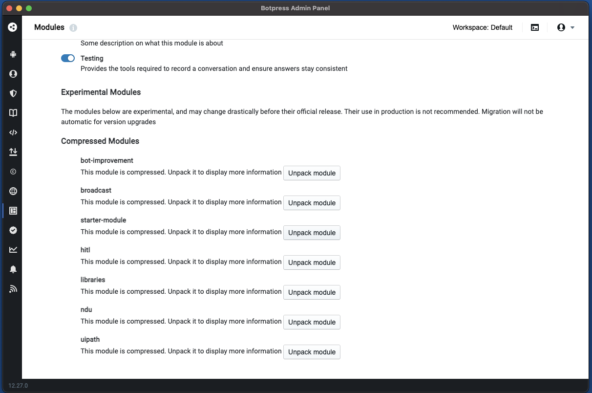

# Starter Module

Last updated by @ptrckbp on June 15th 2022

## Use cases:
1. You want to add hooks to your bots
2. You want to add reusible code to your bot editor
3. You want to update the Botpress bot building experience.

## Overview

This example includes a lot of "boilerplate" to create a module with almost all features you can implement from the documentation
Please check the [official documentation](https://botpress.com/docs/building-chatbots/developers/custom-modules) for more information

## How to use

1. Clone this repo, then copy this folder to a dev folder.
2. Make your changes in the code.
3. To rename the package, change the folder name, the name field in [src/backend/index.ts](src/backend/index.ts) and the name field in [src/backend/index.ts](src/backend/index.ts)
4. Build using the following command. The build will be named "YOUR_PACKAGE_NAME.tgz" where YOUR_PACKAGE_NAME is the name you chose in the previous step and be located in the root folder.
```
sudo docker run -v 'PATH_TO_CURRENT_DIR:/botpress/modules/custom_module' --rm ghcr.io/botpress/botpress/module-builder:0.0.3 sh -c 'cd /botpress/modules/custom_module && yarn && yarn build && yarn package'
```


4.1. After executing the command, the packaged module (in this case starter-module.tgz) will appear in the folder from the module


5. Open Botpress.
6. Go to the modules page.
7. Click Upload Modules. Select and submit the tgz file.
8. Click "Restart Server Now"
9. In the modules page, click unpack now next to your module's name.
9. Go back up to the list of Stable modules, and activate it by clicking the toggle next to the module's name.
10. Start editing a chatbot. notice the flag icon for the custom module.


### Unofficial Video Series
1) [Module Structure](https://share.descript.com/view/F7HWNQVbpEX)
2) [Creating a new module](https://share.descript.com/view/t5iYzfqHrJu)
3) [Backend, API and database](https://share.descript.com/view/C6uaCVLx5wI)
4) [Module Views](https://share.descript.com/view/5FdZBxlzrEe)
5) [Custom Content Types](https://share.descript.com/view/Bz382dj6EFG)
6) [Custom Skills](https://share.descript.com/view/dDOkVlvTaoT)
7) [Bot Templates](https://share.descript.com/view/b6OAuV8C86E)

Videos also available at: https://drive.google.com/drive/folders/1UiXTHTBL5LBib8ogxAZO5Z5gEoshy5kb?usp=sharing

