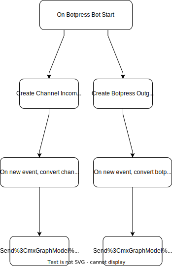

# Adding a New Channel to Botpress

Original author: @ptrckbp

Last updated by @ptrckbp on August 12th 2022

## Overview
Adding a new channel in Botpress is straightforward as you can create remote & local listeners to external events (your channel) and internal events (your bot).  The complexity will depend on the complexity of the type of messages that you want, and will also depend on your channel's SDK / api ease of use. Channels can be directly added via Botpress Hooks, or added to a custom module to be shared.

### Example
The (Botpress) [channel-rocketchat repo](https://github.com/metsrl/channel-rocketchat) is a great example of the integration. Specifically, the pertinent code is found in [src/backend](https://github.com/metsrl/channel-rocketchat/tree/master/src/backend). 

## Overview of technical solution
You need to add two listeners. One that forwards information from your channel to Botpress, and another that forwards Botpress events to your channel. 

## Details

- If you want to build a custom module instead of just adding Global Hooks for re-usability, you can start [here](../Build%20Custom%20Modules%20Using%20Module%20Builder/README.md)
- In your botpress instance, or in your custom module. Write hooks that :
    - register a botpress middleware for before-outgoing that catches outgoing events. The middleware is a listener that captures bot responses, converts them to your channel's format, and sends the payload to your channel. [See example](https://github.com/metsrl/channel-rocketchat/blob/d4344d13311d41dcb13c19ce9b7551d832215631/src/backend/client.ts#L239-L262)
    - register a listener for your channel. You can use your platform's sdk, or simply create a router to catch events and then register it on your platform. The listener listens to events from your channel, converts them to botpress event format, and then sends them to the botpress conversation. [See example](https://github.com/metsrl/channel-rocketchat/blob/d4344d13311d41dcb13c19ce9b7551d832215631/src/backend/client.ts#L127)
- Customize the content however you want. [example of pure text response](https://github.com/metsrl/channel-rocketchat/blob/d4344d13311d41dcb13c19ce9b7551d832215631/src/backend/client.ts#L147)

For most cases, Botpress's built-in content types (text elements, images, videos, buttons etc.) will suffice. You can find documentation on them [here](https://github.com/botpress/typings/blob/master/sdk/botpress.d.ts#L1430-L1479).

