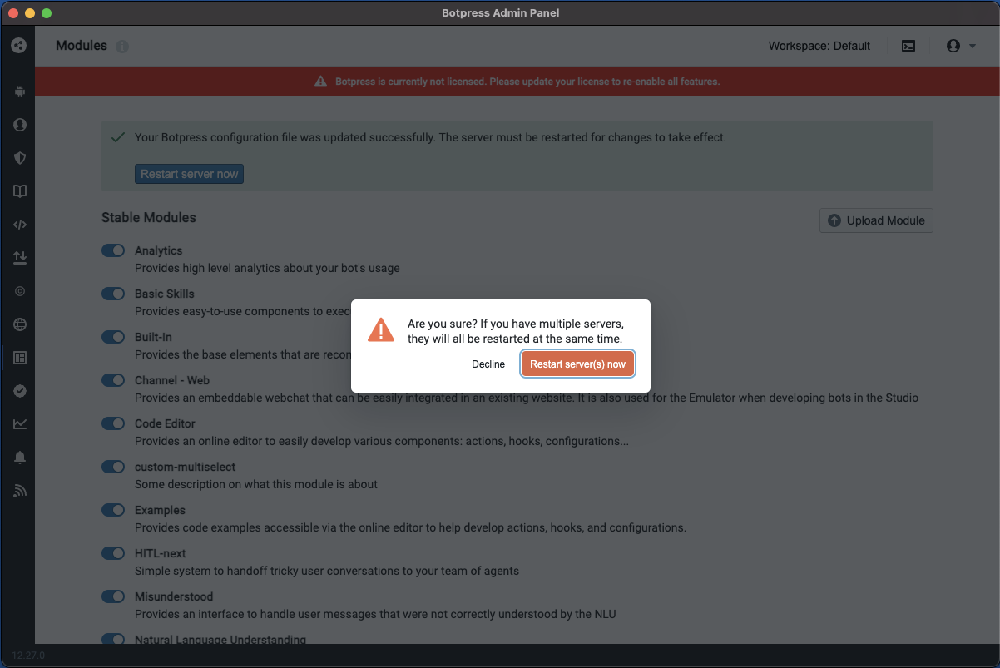

# Build Custom Modules Using Module Builder

Original author: @ptrckbp

Last updated by @ptrckbp on Jun 15th 2022

## Overview
The way of building Botpress Custom modules involves building botpress from source, which takes more time than you would want if you quickly want to build a custom module. The Module Builder allows users to build a usable custom module without buildling Botpress from source. 

## Use cases:
If you have a relatively straightforward change you would like to make, and you don't need to test multiple times while making them, this is perfect.

## How to use
1. Decide on a starting custom module template in [solutions](../../custom%20modules/). If you want a basic repo boilerplate, go for the [starter-module](../../custom%20modules/starter-module/)
2. Clone this repo, and go into the folder of the template you have picked.
3. Make changes to the code you are seeking. See the [documentation](https://botpress.com/docs/building-chatbots/developers/custom-modules) for more details.  
4. run the following command 
```
sudo docker run -v 'PATH_TO_CURRENT_DIR:/botpress/modules/custom_module' --rm ghcr.io/botpress/botpress/module-builder:0.0.3 sh -c 'cd /botpress/modules/custom_module && yarn && yarn build && yarn package'
```


4.1. After executing the command, the packaged module (in this case starter-module.tgz) will appear in the folder from the module


5. The build will be named "YOUR_PACKAGE_NAME.tgz" where YOUR_PACKAGE_NAME is the name of your package (found in package.json and src/backend/index.ts) and be located in the root folder. 
6. Open Botpress and go to the Modules page
7. Click Upload Modules. Select and submit the tgz file.
8. Click "Restart Server Now"
9. In the modules page, click unpack now next to your module's name.
9. Go back up to the list of Stable modules, and activate it by clicking the toggle next to the module's name.
10. Start editing a chatbot. Changes made in your custom module will be injected automatically in the Botpress Studio. 

