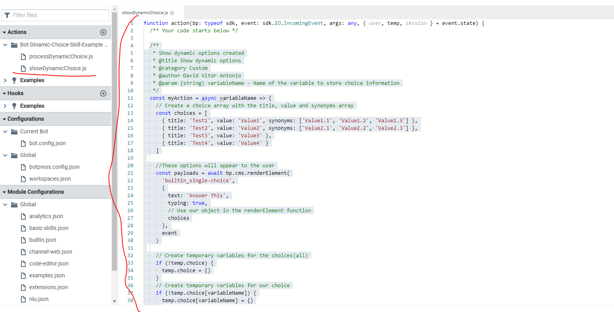
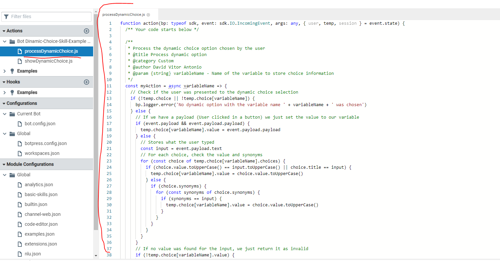
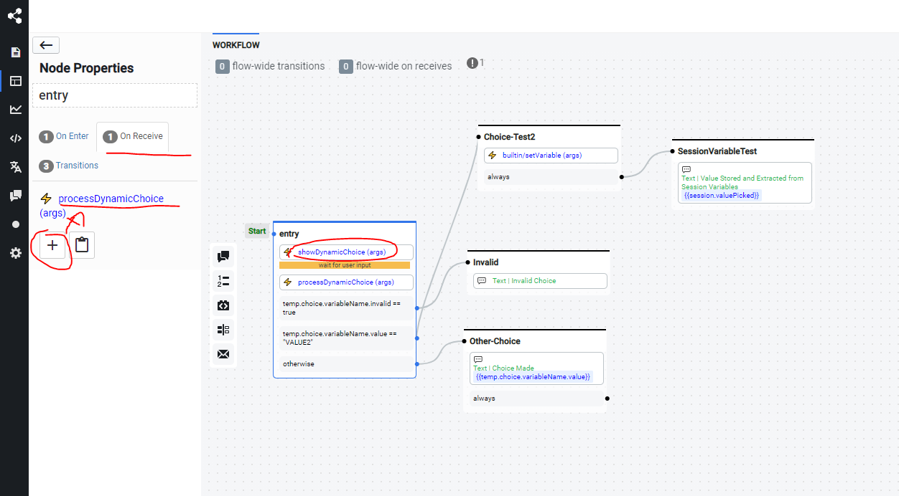
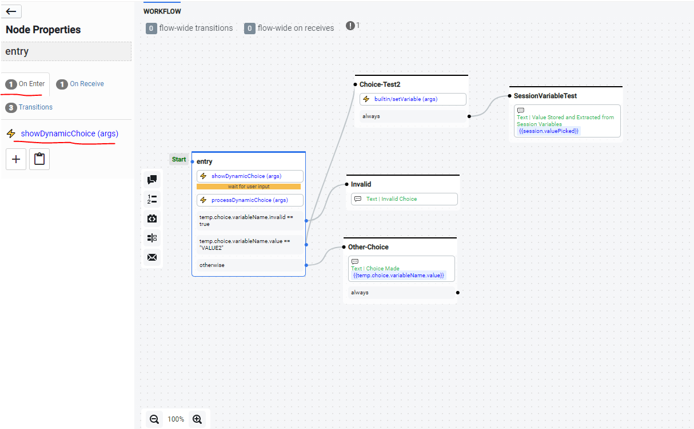
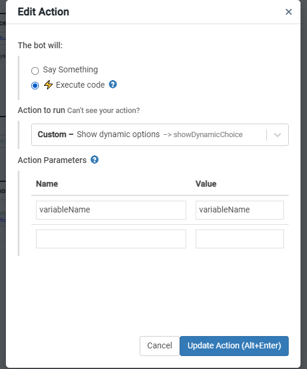
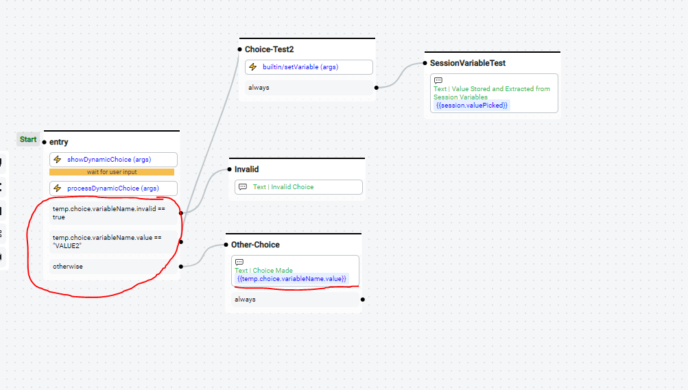

# Create Dynamic Choices (Advanced)

## What it does

This document is a continuation of [Create Dynamic Choices (Basic)](../Basic/README.md). The intent is to add a little bit more functionality to the Choice Flow.

**We are going to add four functionalities:**

1. Text Input Detection
2. Synonyms
3. Automatic Variable Storing
4. Invalidity indicator variable

**To archive this, we need to:**

1. Pass a variable name as an argument to our previous action.
2. Store the available choices and synonyms as a temporary variable.
3. Post-process the choice in a new action using the stored choices and user input.

## How-to

**To do so, we need to:**

1. Change the content of the `showDynamicChoice` action from this:



to this:

```javascript
/**
 * Show dynamic options created
 * @title Show dynamic options
 * @category Custom
 * @author Botpress
 * @param {string} variableName - Name of the variable to store choice information
 */
const myAction = async variableName => {
  // Create a choice array with the title, value and synonyms array
  const choices = [
    { title: 'Test1', value: 'Value1', synonyms: ['Value1.1', 'Value1.2', 'Value1.3'] },
    { title: 'Test2', value: 'Value2', synonyms: ['Value2.1', 'Value2.2', 'Value2.3'] },
    { title: 'Test3', value: 'Value3' },
    { title: 'Test4', value: 'Value4' }
  ]

  //These options will appear to the user
  const payloads = await bp.cms.renderElement(
    'builtin_single-choice',
    {
      text: 'Answer This',
      typing: true,
      payload:
    },
    event
  )

  // Create temporary variables for the choices(all)
  if (!temp.choice) {
    temp.choice = {}
  }
  // Create temporary variables for our choice
  if (!temp.choice[variableName]) {
    temp.choice[variableName] = {}
  }

  // Save choices to process it in the future
  temp.choice[variableName].choices = choices

  bp.events.replyToEvent(
    {
      botId: event.botId,
      channel: event.channel,
      target: event.target,
      threadId: event.threadId
    },
    payloads,
    event.id
  )
}

return myAction(args.variableName)
```

2. Create a new `processDynamicChoice` action with the following code:



```javascript
/**
 * Process the dynamic choice option chosen by the user
 * @title Process dynamic option
 * @category Custom
 * @author Botpress
 * @param {string} variableName - Name of the variable to store choice information
 */
const myAction = async (variableName) => {
  // Check if the user was presented to the dynamic choice selection
  if (!temp.choice || !temp.choice[variableName]) {
    bp.logger.error("No dynamic option with the variable name " + variableName + " was chosen");
  } else {
    // If we have a payload (User clicked in a button) we just set the value to our variable
    if (event.payload && event.payload.payload) {
      temp.choice[variableName].value = event.payload.payload;
    } else {
      // Stores what the user typed
      const input = event.payload.text;
      // For each choice, check the value and synonyms
      for (const choice of temp.choice[variableName].choices) {
        if (choice.value.toUpperCase() == input.toUpperCase() || choice.title == input) {
          temp.choice[variableName].value = choice.value.toUpperCase();
        } else {
          if (choice.synonyms) {
            for (const synonyms of choice.synonyms) {
              if (synonyms == input) {
                temp.choice[variableName].value = choice.value.toUpperCase();
              }
            }
          }
        }
      }
    }
    // If no value was found for the input, we just return it as invalid
    if (!temp.choice[variableName].value) {
      temp.choice[variableName].invalid = true;
    }
  }
};

return myAction(args.variableName);
```

3. In the flow, after receiving the user input, we will need to call the new action (`processDynamicChoice`).



4. We now need to pass `variableName` as an argument to the `showDynamicChoice` action as well (same name).





5. We can now change our current flow to use the now populated choice variable to make decisions.



## Final Result:

[Video](<Video/Dynamic Choices Result (Advanced).mp4>)

[Example Bot](Bot/bot_bot_dynamic-choice-skill-example-advanced_1620999077507.tgz)
