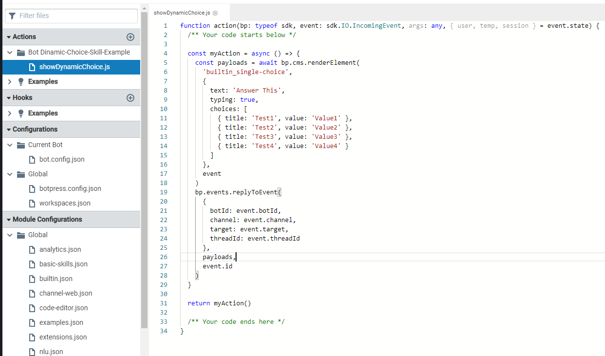
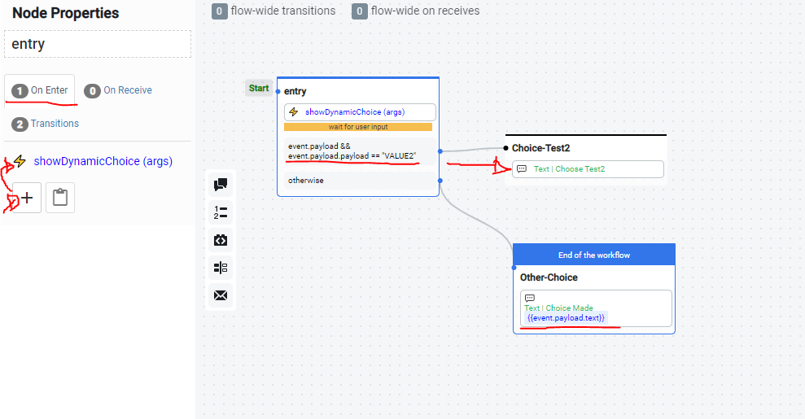
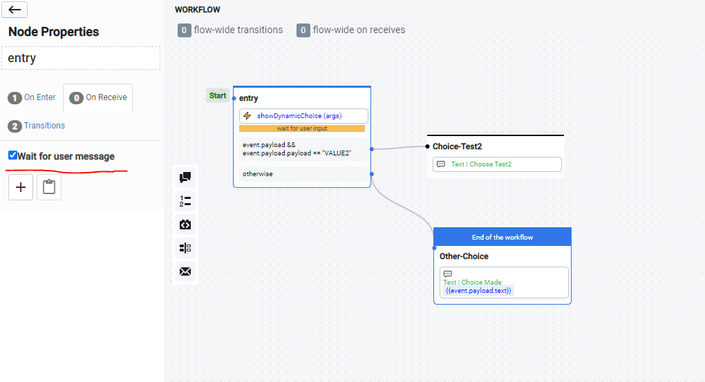
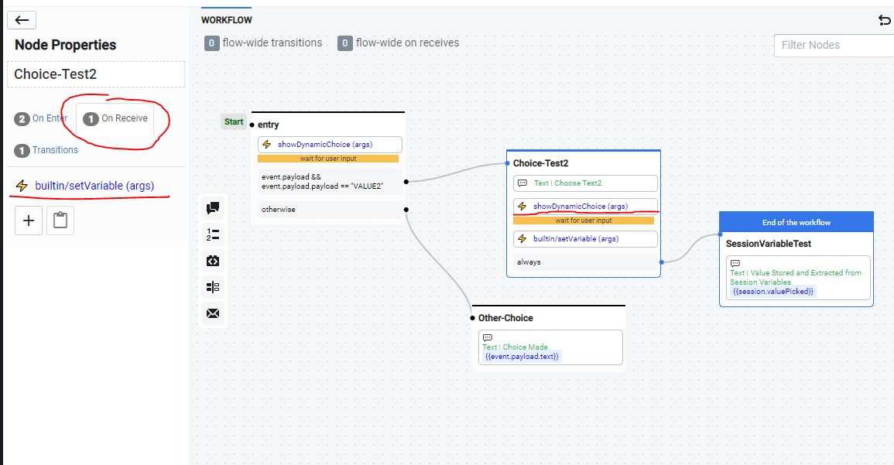
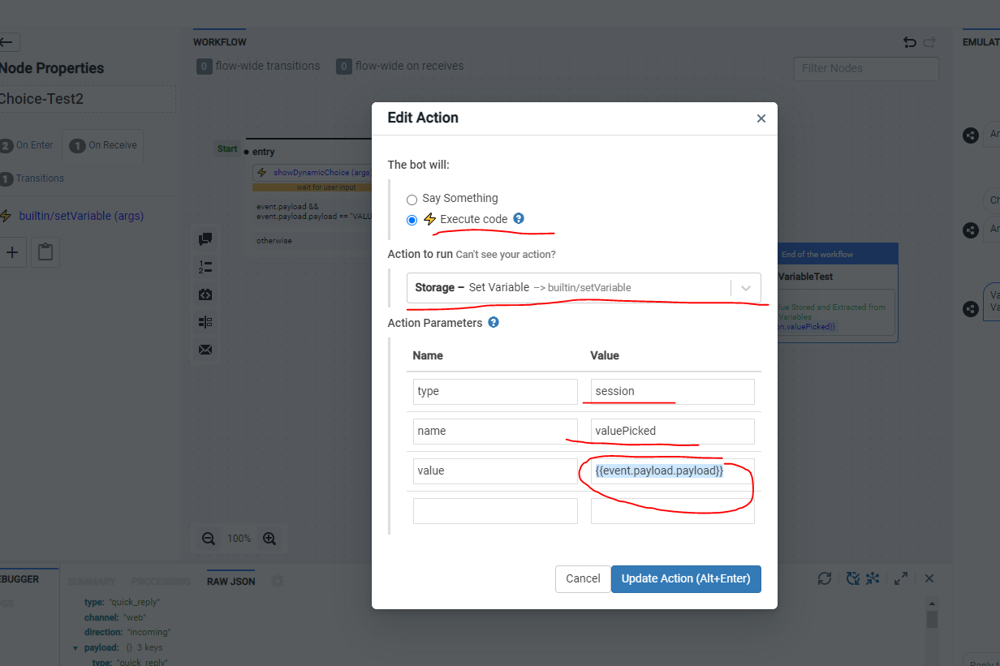
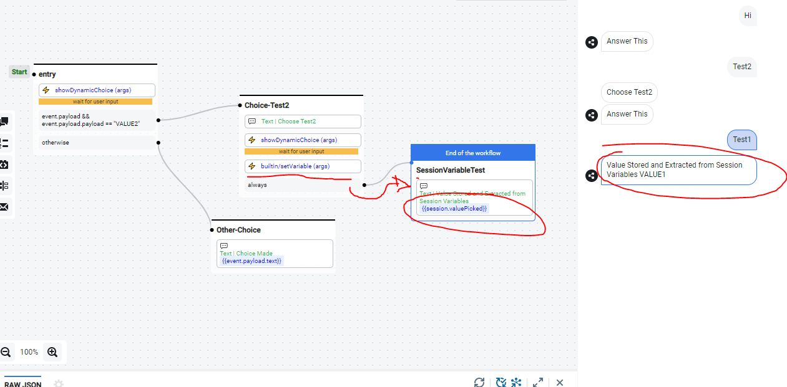
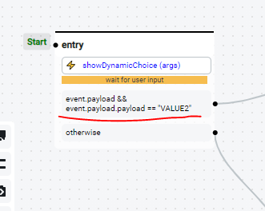
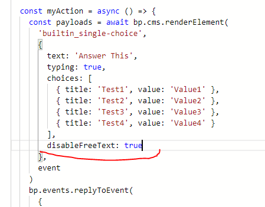

# Create Dynamic Choices (Basic)

## How-to

### Create an Action

The easiest way to create a dynamic single-choice is to use a custom action.



First, we need to render a built-in single-choice using `bp.cms.renderElement`. Then we need to reply to the chat event using that rendered payload.

Modify the code below to generate the desired single-choice:

```javascript
/**
 * Create and send a dynamic single-choice
 * @title Dynamic Single-Choice
 * @category Custom
 * @author Botpress
 */
const dynamicSingleChoice = async () => {
  const payloads = await bp.cms.renderElement(
    "builtin_single-choice",
    {
      text: "Answer This",
      typing: true,
      choices: [
        { title: "Test1", value: "Value1" },
        { title: "Test2", value: "Value2" },
        { title: "Test3", value: "Value3" },
        { title: "Test4", value: "Value4" },
      ],
    },
    event
  );

  bp.events.replyToEvent(
    {
      botId: event.botId,
      channel: event.channel,
      target: event.target,
      threadId: event.threadId,
    },
    payloads,
    event.id
  );
};

return dynamicSingleChoice();
```

### Call the Action

To use the action, we need to call it inside a standard node. The **selected value**, can be accessed with `event.payload.payload` and the **selected text** is available with `event.payload.text`, if needed.



For this to work, we also need to wait for the user input before transitioning to the next node:



We can also store the chosen value in a variable before evaluating it:



Below, we are storing it as a session variable to access it later:





## Example Bot

[Example Bot](Bot/bot_dynamic-choice-skill-example_1620996642495.tgz)

## Caveats:

If the user types a text instead of selecting a value, we won't be able to match it with a choice. To prevent errors, you can try to access it only if `event.payload` is valid, like below:



Another alternative is to disable the text input when options are displayed using the `disableFreeText` option inside the action.


