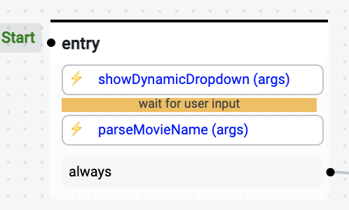

# Create a Dynamic Dropdown with Fuzzy Matching

## Description

This solution shows you how to show a dropdown from data pulled from an API.
It also implements a functionality where the chatbot user can write down the option he chooses instead of clicking on the dropdown.
The fuzzy matcher that is part of this solution will make a best effort to match the user input with one of the dropdown choices.

## How-To

1. Create an action, this action will show the dropdown:

```javascript
const axios = require("axios");

/**
 * Show dynamic options created
 * @title Show dynamic dropdown
 * @category Custom
 * @author Botpress
 */
const myAction = async () => {
  const { data } = await axios.get("<YOUR API ENDPOINT>");
  // Format your data so that it is in the form of:
  // [{ label: "Text shown as an option in the dropdown", value: "value sent to botpress" }, ...]
  const options = data.map(({ id, title }) => ({ label: title, value: id }));

  //These options will appear to the user
  const payloads = await bp.cms.renderElement(
    "dropdown",
    {
      message: "Text message shown above the dropdown",
      placeholderText: "Text shown in the dropdown to give users a hint",
      typing: true,
      options,
    },
    event
  );

  bp.events.replyToEvent(
    {
      botId: event.botId,
      channel: event.channel,
      target: event.target,
      threadId: event.threadId,
    },
    payloads,
    event.id
  );
};

return myAction();
```

2. Create a second action, this action will parse the option the user selected

```javascript
class FuzzySearch {
  /**
   * Fuzzy text search using bi-grams and tri-grams with a cosine similarity measure
   */
  constructor(array, opts = {}) {
    this.array = array;
    this.opts = {
      lower: opts.lower || 2,
      upper: opts.upper || 3,
    };
    this.exactSet = {};
    this.matchMap = {};
    this.items = {};
    this._initialize();
  }

  _initialize() {
    for (let i = this.opts.lower; i < this.opts.upper; i++) {
      this.items[i] = [];
    }
    this.array.forEach((el) => this.add(el));
  }

  static normalize(str) {
    return str.toLowerCase();
  }

  static listNGrams(value, size = 2) {
    let simplified =
      "-" +
      value.toLowerCase().replace(/[^a-zA-Z0-9\u00C0-\u00FF, ]+/g, "") +
      "-";
    const lDiff = size - simplified.length;
    const results = [];

    if (lDiff > 0) {
      for (var i = 0; i < lDiff; ++i) {
        simplified += "-";
      }
    }
    for (var i = 0; i < simplified.length - size + 1; ++i) {
      results.push(simplified.slice(i, i + size));
    }
    return results;
  }

  static getNGramsCount(value, size = 2) {
    const result = {};

    const nGrams = FuzzySearch.listNGrams(value, size);

    for (let i = 0; i < nGrams.length; ++i) {
      if (nGrams[i] in result) {
        result[nGrams[i]] += 1;
      } else {
        result[nGrams[i]] = 1;
      }
    }
    return result;
  }

  find(value, threshold = 0.33) {
    let results = [];
    // start with high gram size and if there are no results, go to lower gram sizes
    for (
      let gramSize = this.opts.upper;
      gramSize >= this.opts.lower;
      --gramSize
    ) {
      results = this._find(value, gramSize, threshold);
      if (results && results.length > 0) {
        return results;
      }
    }
    return null;
  }

  _find(value, size, threshold) {
    const normalizedValue = FuzzySearch.normalize(value);
    const matches = {};
    const gramCounts = FuzzySearch.getNGramsCount(normalizedValue, size);
    const items = this.items[size];
    let sumOfSquareGramCounts = 0;

    for (let gram in gramCounts) {
      let gramCount = gramCounts[gram];
      sumOfSquareGramCounts += Math.pow(gramCount, 2);
      if (gram in this.matchMap) {
        for (let i = 0; i < this.matchMap[gram].length; ++i) {
          let index = this.matchMap[gram][i][0];
          let otherGramCount = this.matchMap[gram][i][1];
          if (index in matches) {
            matches[index] += gramCount * otherGramCount;
          } else {
            matches[index] = gramCount * otherGramCount;
          }
        }
      }
    }

    if (!Object.keys(matches).length) {
      return null;
    }

    const vectorNormal = Math.sqrt(sumOfSquareGramCounts);

    const results = Object.entries(matches).map(([index, score]) => ({
      score: score / (vectorNormal * items[index][0]),
      value: items[index][1],
    }));

    return results
      .map(({ score, value }) => ({ score, value: this.exactSet[value] }))
      .filter((r) => r.score >= threshold)
      .sort((a, b) => {
        if (a[0] < b[0]) {
          return 1;
        } else if (a[0] > b[0]) {
          return -1;
        } else {
          return 0;
        }
      });
  }

  add(value) {
    const normalized = FuzzySearch.normalize(value);
    if (normalized in this.exactSet) {
      return;
    }
    for (let i = this.opts.lower; i < this.opts.upper; i++) {
      this._add(value, i);
    }
  }

  _add(value, size) {
    const normalized = FuzzySearch.normalize(value);
    const items = this.items[size] || [];
    let index = items.length;

    items.push(0);
    var nGramCounts = FuzzySearch.getNGramsCount(normalized, size);
    let sumOfSquareNGramCounts = 0;

    for (let gram in nGramCounts) {
      let gramCount = nGramCounts[gram];
      sumOfSquareNGramCounts += Math.pow(gramCount, 2);
      if (gram in this.matchMap) {
        this.matchMap[gram].push([index, gramCount]);
      } else {
        this.matchMap[gram] = [[index, gramCount]];
      }
    }

    var vectorNormal = Math.sqrt(sumOfSquareNGramCounts);

    items[index] = [vectorNormal, normalized];

    this.items[size] = items;
    this.exactSet[normalized] = value;
  }
}

const axios = require("axios");
/**
 * Parses user input for a best match
 * @title Parse dropdown input
 * @category Custom
 * @author Charles Catta
 */
const myAction = async () => {
  const { data } = await axios.get("<YOUR API ENDPOINT>");

  // We only want an array of string to give to the searcher
  const names = data.map((m) => m.title);

  const searcher = new FuzzySearch(names);
  // Return type is:
  // [{
  //    score: <match score between 0.0 and 1.0>,
  //    value: "<full string of match>"
  //  }, ...]
  // Will return null if no matches are found
  const results = searcher.find(event.payload.text);

  if (!results) {
    session.match = null;
    return;
  }

  // get the top score
  const result = results.sort((a, b) => b.score - a.score)[0];

  session.match = result;
};

return myAction();
```

3. Add the actions to your flow
   
